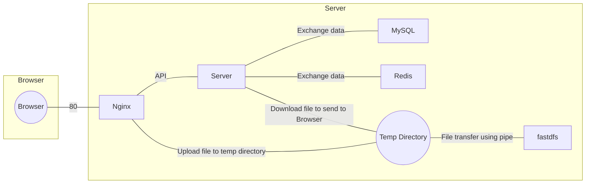

# Share Shift

[toc]

build a cloud share platform with fastdfs and nginx


## Install

first, you need to build the enviroment, see [the enviroment file](./docs/enviroment.md), then you can install the project as follow:

```bash
    # install
    mkdir build
    cd build
    cmake ..
    make
```

## Usage

```bash
    cd ShareShift
    cp share_shift.conf ShareShift/build
    tmux
    ./share_shift
```

## Project Structure

