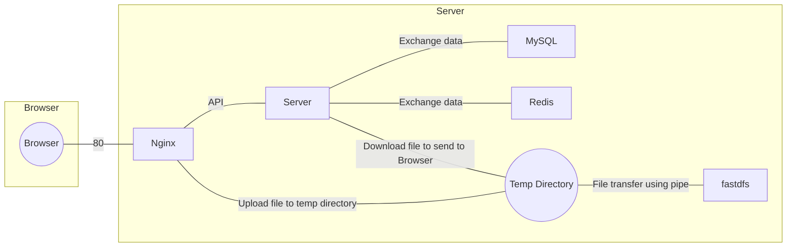

## Project Structure

```mermaid
graph LR
    subgraph Browser
    B((Browser))
    end
    subgraph Server
    N[Nginx]
    S[Server]
    M[MySQL]
    R[Redis]
    F[fastdfs]
    T((Temp Directory))
    end
    B ---|80| N
    N ---|API| S
    N ---|Upload file to temp directory| T
    T ---|File transfer using pipe| F
    S ---|Download file to send to Browser| T
    S ---|Exchange data| M
    S ---|Exchange data| R

```